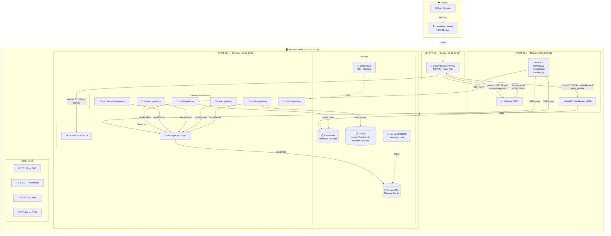
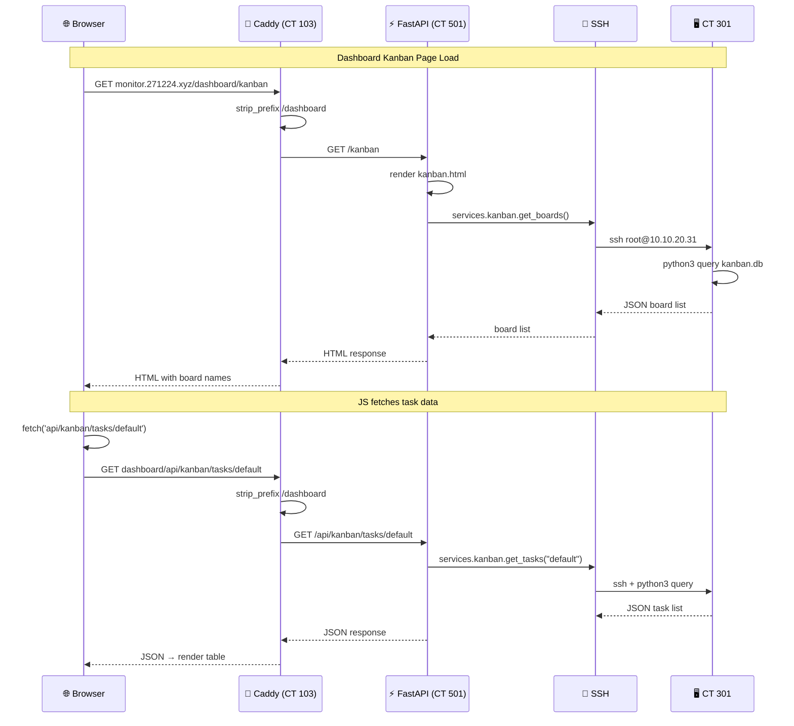
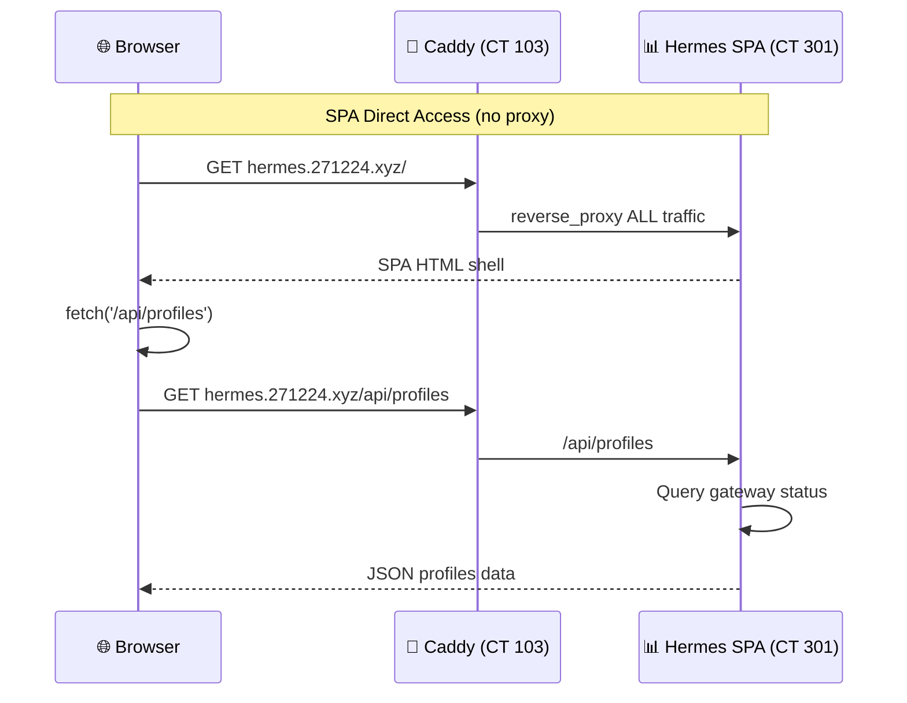
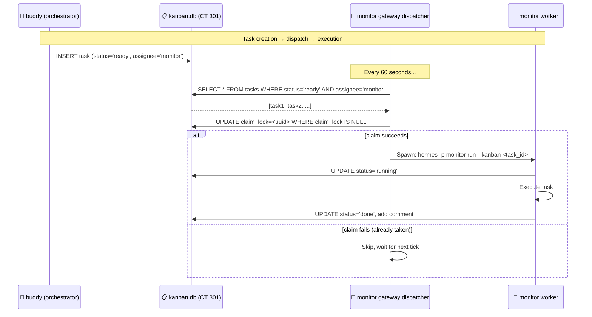
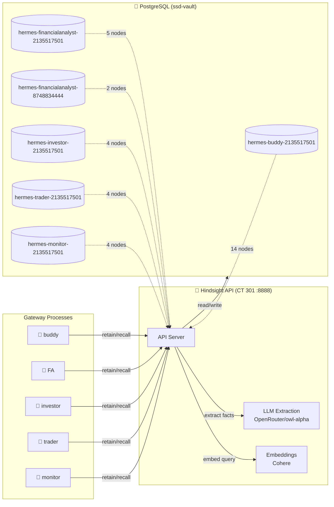
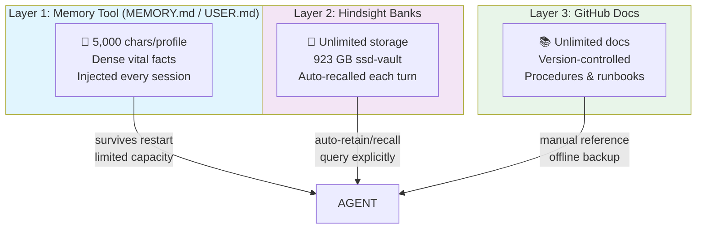
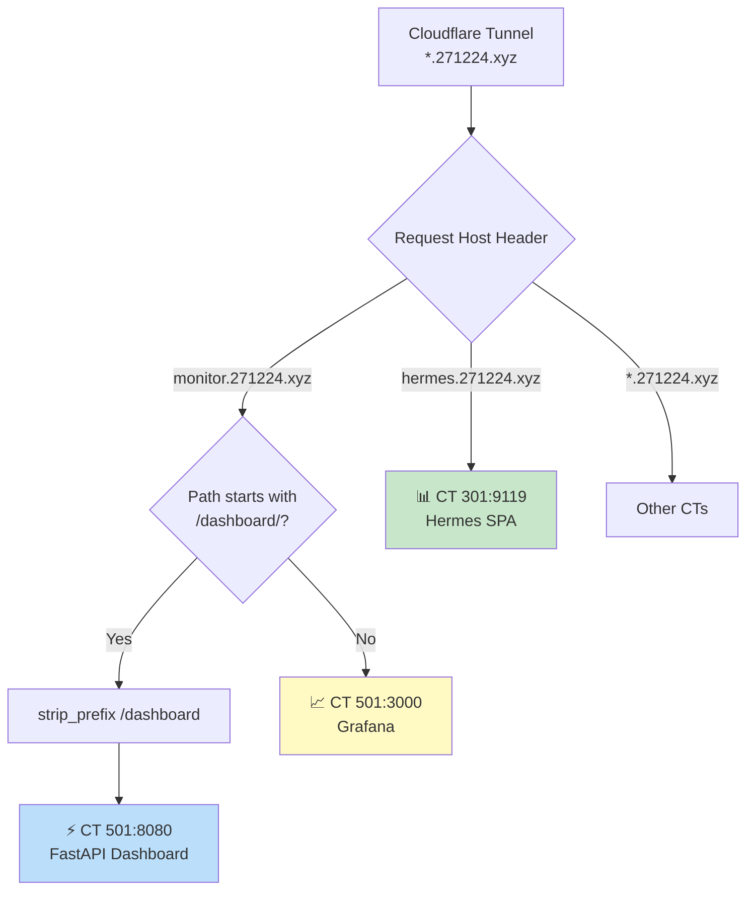

# Architecture Diagrams

> Mermaid diagrams for the Hermes Agent infrastructure.

---

## Complete System Architecture

---

## Dashboard Data Flow

---

## SPA Data Flow

---

## Cross-Profile Kanban Dispatch

---

## Memory System (Hindsight)

---

## Multi-Layer Memory

---

## Caddy Routing Decision Tree

